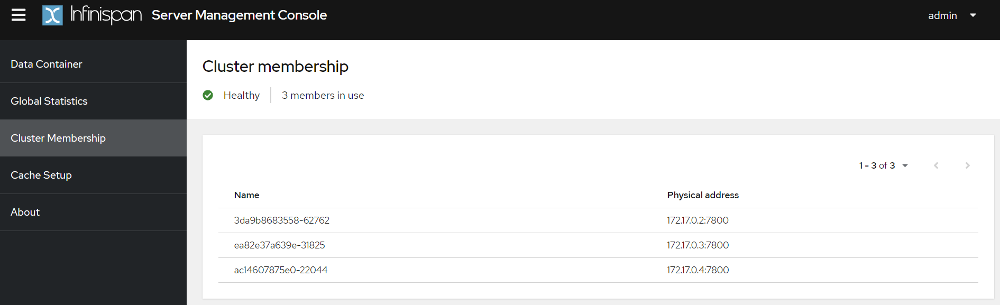
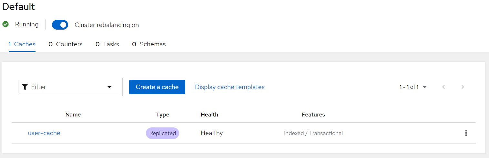
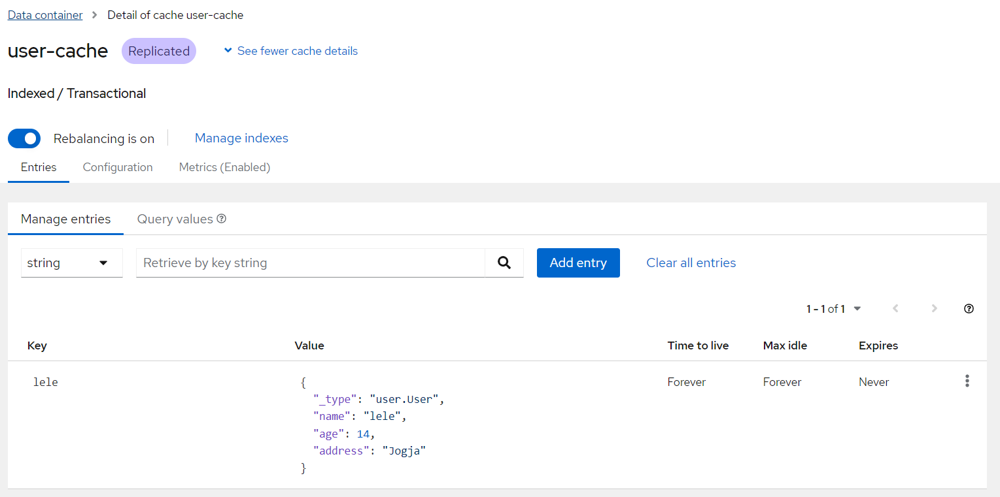

# About
A sample Spring Boot 3 and Infinispan integration. A multiple instances of Infinispan is installed, and connecting to eachother to form a cluster.

## Running Infinispan
Pull from Docker Hub
```
$ docker pull quay.io/infinispan/server:13.0.10.Final
```

Run the first instance
```
$ docker run -p 11222:11222 -e USER=admin -e PASS=password \
        --add-host=HOST:192.168.56.1 \ 
        quay.io/infinispan/server:13.0.10.Final
```

Run the second instance
```
$ docker run -p 11223:11222 -e USER=admin -e PASS=password \
        --add-host=HOST:192.168.56.1 \ 
        quay.io/infinispan/server:13.0.10.Final
```

Run the third instance
```
$ docker run -p 11224:11222 -e USER=admin -e PASS=password \
        --add-host=HOST:192.168.56.1 \ 
        quay.io/infinispan/server:13.0.10.Final
```

We can validate the result after we login into Infinispan server,


## Frameworks
- Spring Boot 3.0.4
- Infinispan 13.0.10.Final

## Infinispan Configuration
We are using below XML configuration for setting up a distributed cache.
```xml
<?xml version="1.0"?>
<replicated-cache name="user-cache" mode="SYNC" remote-timeout="300000" statistics="true">
    <encoding>
        <key media-type="application/x-protostream"/>
        <value media-type="application/x-protostream"/>
    </encoding>
    <locking concurrency-level="1000" isolation="READ_COMMITTED" acquire-timeout="60000" striping="false"/>
    <transaction mode="NON_XA" auto-commit="true" stop-timeout="30000" locking="PESSIMISTIC" reaper-interval="30000" complete-timeout="60000" notifications="true" transaction-manager-lookup="org.infinispan.transaction.lookup.GenericTransactionManagerLookup"/>
    <memory storage="OFF_HEAP"/>
    <state-transfer timeout="300000"/>
    <indexing enabled="true"
              storage="filesystem" path="user-cache">
        <indexed-entities>
            <indexed-entity>user.User</indexed-entity>
        </indexed-entities>
    </indexing>
</replicated-cache>
```

## Spring Boot Configuration
We can put all servers that are members of the cluster on the `remoteCacheManager` method.
```java
    @Bean
public RemoteCacheManager remoteCacheManager() {
        return new RemoteCacheManager(
        new org.infinispan.client.hotrod.configuration.ConfigurationBuilder()
        .addServers("172.17.0.2:11222;172.17.0.3:11222;172.17.0.4:11222")
        .security().authentication().username("admin").password("password")
        .clientIntelligence(ClientIntelligence.HASH_DISTRIBUTION_AWARE)
        .marshaller(ProtoStreamMarshaller.class)
        .build());
        }
```

## How to Test
Create a new data in a cache store
```
$ curl -kv http://localhost:8080/add-user?name=lele&age=14&address=Jogja
{"name":"lele","age":14,"address":"Jogja"} 
```

Get the data from a cache store
```
$ curl -kv http://localhost:8080/get-user?name=lele
{"name":"lele","age":14,"address":"Jogja"} 
```

Sample data stored on `user-cache`


